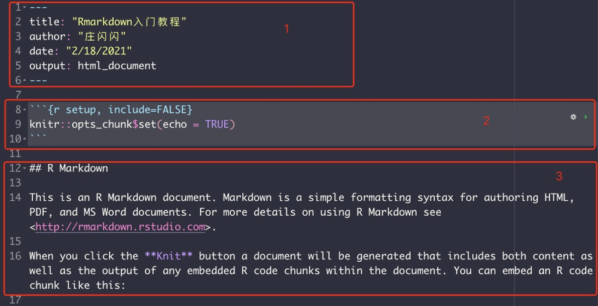
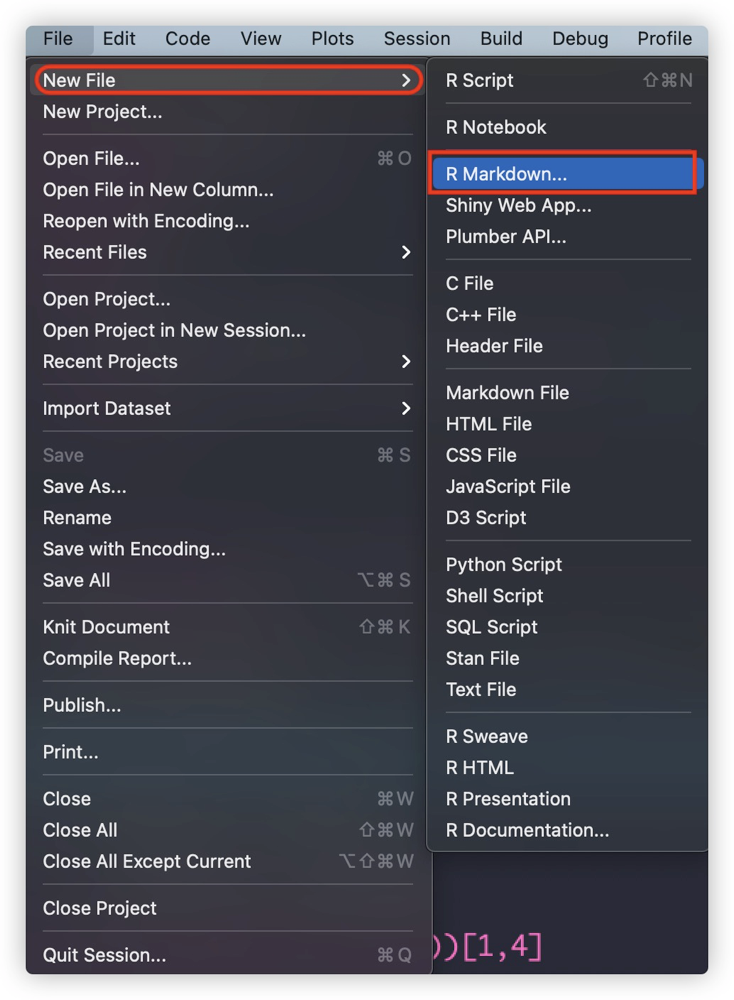

```{r setup, include=FALSE}
knitr::opts_chunk$set(echo = TRUE)
```

# 前期准备

## 认识 R 语言和 R studio

### R语言

R是一种开源的编程语言和软件环境，专门用于统计分析和图形表示。由Ross Ihaka和Robert Gentleman在奥克兰大学开发，自1995年以来一直在积极发展。R语言具有高度的可扩展性，广泛用于统计软件开发和数据分析。

R具有以下特点：

- **数据分析**：提供各种统计（线性和非线性建模、经典统计测试、时间序列分析、分类、聚类等）和图形技术。
- **编程语言**：提供控制流语句、用户定义的递归函数和输入输出设施。
- **图形能力**：能够以高质量地输出在屏幕或者文件中，并支持多种格式，如PNG、PDF、SVG等。
- **包系统**：拥有强大的包系统，全球范围内的贡献者创建并维护了上千个可供专门任务使用的包。
- **扩展性**：R可以很容易地通过包进行扩展，并且R的社区非常活跃，提供了海量的资源和支持。

### RStudio

RStudio是一个为R语言开发的强大的集成开发环境（IDE）。它提供了友好的用户界面，使得编写R代码、绘图、管理文件、执行代码和查看数据变得更加容易和高效。RStudio可以在Windows、Mac和Linux系统上运行，同时也提供了一个服务器版本，可以在远程服务器上运行并通过网页浏览器访问。

RStudio的主要特点包括：

- **代码编写**：自动代码补全、语法高亮、代码折叠等功能。
- **数据可视化**：内置的图形预览，以及对ggplot2等图形工具的支持。
- **项目管理**：通过项目管理轻松组织和切换工作环境。
- **版本控制**：集成了Git和Subversion，便于进行版本控制和协同工作。
- **包开发**：提供了包开发辅助工具，简化了R包的创建和维护流程。
- **数据查看与管理**：一个易用的数据查看器，支持查看大型数据集。
- **扩展插件**：支持各种RStudio插件，例如Shiny，允许用户构建交云互动应用程序。

## 认识 Rmarkdown 

### R Markdown 文件

R Markdown是一个简化的文档格式，它将R语言的代码和Markdown文档语法结合在一起，允许用户创建动态文档、报告、演示文稿和仪表盘。它基于Pandoc，这是一个转换文档格式的工具，并可以轻松地将RMarkdown文件转换为多种文档格式，如HTML、PDF、Word等。

R Markdown文件通常拥有`.Rmd`扩展名，它包含三种主要类型的内容：



- **元数据区域 YAML**：在文档开头，使用YAML格式定义文档的标题、作者、日期和输出格式等设置。
- **文本区域 markdown 文本**：使用Markdown语法编写，可以创建标题、列表、链接、图片、表格等。
- **代码块**：R代码被包含在“```{r} ... ```”中，当文档被编译时，代码块中的代码会被执行，它的结果可以被包含在最终文档中。

### 用法

要开始使用R Markdown，你只需要打开RStudio，创建一个新的R Markdown文件，然后开始写Markdown文本和R代码。编译这个文档，RStudio会执行R代码块，并将结果嵌入到最终生成的文档中。

例如，你可以使用以下步骤来创建和编译一个R Markdown文档：

1. 在RStudio中，选择“File” > “New File” > “R Markdown…”。
2. 选择文档类型（报告、演示文稿等）并填写标题和作者等信息。
3. 在编辑器中撰写Markdown文本和R代码。
4. 点击“Knit”按钮，选择输出格式。
5. RStudio将运行代码，并生成HTML、PDF或Word等格式的文档。



### 优点

R Markdown的主要优点包括：

- **复制性**：代码和文档结合在一起，可以确保结果的复制性和透明度。
- **动态内容**：文档内容可以动态生成，例如，根据新的数据更新图表和分析结果。
- **多种输出格式**：一个R Markdown文件可以生成多种格式的文档，灵活适应不同的展示需求。
- **易于学习**：Markdown语法简单，易于学习和使用，而且RStudio提供了很好的支持。
- **自定义和扩展性**：通过LaTeX或HTML模板，用户可以高度自定义文档的外观。
- **交互性**：可以集成Shiny应用程序，创建交互式文档和仪表盘。
- **版本控制友好**：Markdown文本文件非常适合版本控制，便于追踪文档的更改历史。

# 开始实践

## 如何装包 intsll.packages()

使用install.packages()函数来安装包。一个包只需要装一次就可以，下一次使用直接用library()调取即可。

对于数据分析，有一些常用的包是dplyr（数据操作）、ggplot2（数据可视化）、tidyr（数据整理）、readr（数据输入）、tibble（现代化的数据框）、stringr（字符串操作）、lubridate（日期时间操作）、forcats（因子变量操作）、purrr（函数式编程）等。

tidyverse集合了上述大多数包，所以安装tidyverse就包含了大部分工具。

### 手动一个个装载 install one by one
```{r}
# install.packages("tidyverse")
# install.packages("ggplot2")
# install.packages("plotly")
# install.packages("openxlsx")
```

### 一下子装很多个！
```{r}
# packages <- c("tidyverse", "data.table", "readxl", "lubridate", "stringr", "rmarkdown", ....., "plotly")

# install.packages(packages)

```

### library() 加载需要的包
```{r}
library(openxlsx)
library(dplyr)
library(ggplot2)
library(tidyr)
```

### 选择工作路径

更方便一点直接在右侧进入工作路径点击小齿轮设为工作路径
setwd("/path/to/my/directory")

### 数据读入
（csv 数据读入：read.csv("")）
```{r}
wb <- loadWorkbook("test_file.xlsx")
s1 = read.xlsx(wb, sheet = 1)
s2 = read.xlsx(wb, sheet = 2)
```

# 查看并认识数据
```{r}
head(s1, n=2)
```

## 查看数据结构：包括几个variable和数据类型
```{r}
str(s1)
```
## 每一个variable的摘要：
包括min, Q1 (25%的数据小于或者等于这个数值), median/Q2, mean, Q3, max
```{r}
summary(s1)
```

## 检查行数 number of rows
```{r}
nrow(s1)
nrow(s2)
```
## 检查列数 number of columns
```{r}
ncol(s1)
ncol(s2)
```

## 检查有几个na数值
```{r}
#is.na() 返回一个完成只有true, false的数据表，是na项则为true，否则是false
na_count = sum(is.na(s1))
na_count
```

## 去掉所有带有na的行，如果不想覆盖原数据就保存一个新的dataframe
```{r}
s1 = na.omit(s1)
```

## 将指定列有na值替换成 0

```{r}
s2$Asylum.seekers.Incoming = replace(s2$Asylum.seekers.Incoming, is.na(s2$Asylum.seekers.Incoming), 0)
```

## 像指定列na值替换成 median

```{r}
s2$Number.of.Applications.Incoming[is.na(s2$Number.of.Applications.Incoming)] <- median(s2$Number.of.Applications.Incoming, na.rm = TRUE)
```

## 确定outlier

## 使用（IQR）处理

通常使用计算四分位距离（Interquartile Range/IQR）, outlier被定义为那些低于第一分位数\( Q1 \)减去1.5倍IQR的值，或者高于第三分位数\( Q3 \)加上1.5倍IQR的值。

```{r}
data_vector <- c(1,2,3,4,4,4,4,5,5,100,7,-1000)
q1 = quantile(data_vector, 0.25)
q3 = quantile(data_vector, 0.75)
iqr = q3 - q1

#定义outlier界限
lower_bound = q1 - 1.5 * iqr
upper_bound = q3 + 1.5 * iqr

#检查outlier，'|' 是 or 的意思，‘&’ 是 and 的意思
outlier = data_vector[data_vector < lower_bound | data_vector > upper_bound]

print(outlier)
```

## 简单粗暴去掉1%极值

简单地去掉最高的1%和最低的1%的数据。这个方法很直接，但可能会不小心去掉一些真实的极端值，这些极端值可能对我们理解整个数据集很重要。所以使用这个方法时需要谨慎。

```{r}

# 计算1%和99%的分位数
quantiles <- quantile(data_vector, probs = c(0.01, 0.99))

# 剔除低于1%和高于99%的数据
data_filtered <- data_vector[data_vector > quantiles[1] & data_vector < quantiles[2]]
data_filtered
```

### 在表中新增一列为其他列之和 
和计算器一样其他之差，之积修改符号即可）如果$后选择已有列，会直接覆盖原数据
```{r}
s1$sum = s1$type_of_violence + s1$active_year
```

### 随便生成一个数据
```{r}
df <- data.frame(col1 = c(1, 1, 2, 2), col2 = c("A", "A", "B", "B"), col3 = c(100, 100, 200, 300))
df
```

### 将字符列转换为factor：
```{r}
df$col2 = as.factor(df$col2)
```

### 查看某一列数据类型

```{r}
str(df$col2)
```

### 返回唯一值
unique() 函数
用于从向量、数据框或其他对象中移除重复元素，只返回唯一值。
对于数据框，unique() 函数会返回所有不重复的行。
```{r}
unique_df <- unique(df)
unique_df
```

### 计算给定列中唯一值的个数

count() 函数通常在 dplyr 包中使用，用于快速计算给定列中唯一值的个数。

```{r}
count_df <- df %>%
  count(col2)
count_df
```

### 保存文件
保存成excel文件, write.csv() 则保存csv文件
```{r}
write.xlsx(s1, file = "result.xlsx", rowNames = FALSE)
```

# 进阶数据处理

### 选择特定列成为新数据

```{r}
subset = s2[c("id","Year")]
head(subset,n=2)
```

### 根据第几列重命名
```{r}
colnames(subset)[2] <- "year"
head(subset,n=2)
```

### 根据指定列排序

如果多列，只需要在order后面加入条件即可

```{r}
id_sorted <- subset[order(subset$id), ]
head(id_sorted,n=2)
```

### 查找重复行数量

```{r}
duplicated_sums <- sum(duplicated(subset))
duplicated_sums
```

### 移除重复行
```{r}
subset <- subset[!duplicated(subset), ]
```

### 根据指定列数值进行subset

```{r}
subset2020 = subset[subset$year == "2020", ]
head(subset2020,n=2)
```

### 表格合并

```{r}
df1 <- data.frame(Key = c("A", "B", "C"), Value = 1:3)
df2 <- data.frame(Key = c("B", "C", "D"), Value = 4:6)
df1
df2
```
### 使用 rbind() 合并数据
rbind() 函数用于按行（row-wise）合并两个或多个数据框或矩阵，它们必须有相同数量的列，并且相应的列需要具有相同的数据类型
```{r}
combined_df <- rbind(df1, df2)
combined_df
```

### 使用 dplyr 包实现 join 操作 

### 内连接（Inner join）
通过variable "Key" 内连接（Inner join）返回两个数据框中匹配键的交集。

```{r}
inner_joined <- inner_join(df1, df2, by = "Key")
inner_joined
```
### 左连接 left join
通过variable "Key" 左连接 left join 返回第一个数据框的所有行，并与第二个数据框中的匹配行相连接。
```{r}
left_joined <- left_join(df1, df2, by = "Key")
left_joined
```

### 右连接 right join
通过variable "Key" 右连接 right join 返回第二个数据框的所有行，并与第一个数据框中的匹配行相连接。

```{r}
right_joined <- right_join(df1, df2, by = "Key")
right_joined
```
### 外连接（Full join）
返回两个数据框中所有匹配的行
```{r}
full_joined <- full_join(df1, df2, by = "Key")
full_joined
```


# 再进阶一些

### 使用`mutate()`和`filter()`进行数据转换
```{r}
## 创建 dataframe
df <- data.frame(col1 = c(1, 1, 2, 2), col2 = c("A", "A", "B", "B"), col3 = c(100, 100, 200, 300))

df <- df %>%
  mutate(new_column = col3 / col1) %>%
  filter(col1 > 0)
df
```

每一行代码的功能如下：

2. `data <- data %>% ...`: `%>%`是管道操作符，它会将左边的结果作为右边函数的第一个参数传递。在这个上下文中，它的意思是“拿`data`数据框然后应用以下函数”。

3. `mutate(new_column = column3 / column1)`: `mutate()`函数用于添加新列或改变现有列。这里，它创建了一个名为`new_column`的新列，该列的值是`column1`除以`column2`的结果。

4. `filter(column1 > 0)`: 创建新列后，使用`filter()`来保留`column1`大于0的行。

执行这一系列命令后，`data`将会新增一个列，并且只包含`column1`为正数的行。

### 使用`group_by()`和`summarise()`进行数据分组和汇总

```{r}
summary_data <- df %>%
  group_by(col2) %>%
  summarise(mean_value = mean(col3, na.rm = TRUE))
summary_data
```

2. `summary_data <- data %>% ...`: 这是另一个应用于`data`的`dplyr`函数链，并将结果存储在`summary_data`中。

3. `group_by(group_column)`: `group_by()`函数用于根据`column2`的唯一值在数据中创建分组。之后的所有操作都是在这些分组内部进行，而不是在整个数据集上进行。

4. `summarise(mean_value = mean(col3, na.rm = TRUE))`: 分组后，使用`summarise()`函数将每个组合并成一个单一的汇总行。在这个案例中，它为每个组计算`col3`的平均值。参数`na.rm = TRUE`告诉平均数函数忽略`NA`（缺失）值。

`summary_data`将包含每个唯一`col2`值的`col3`的平均值。


## 高阶函数 apply（）

用来应用某个函数于数据框或矩阵边缘的高阶函数。基本上，你可以用它来对行或列执行一个函数。apply() 函数的一般形式如下：apply(X, MARGIN, FUN, ...)

X 是输入的数组，数据框（data frame）或矩阵（matrix）
MARGIN 是一个整数，指定你想要应用函数的维度。1 表示行，2 表示列。
FUN 是要应用的函数


```{r}
df <- data.frame(a = c(1, 3, 5), b = c(2, 4, 6))
df
```
### 找出每一行最大值
```{r}
apply(df, 1, max)
```

### 创建一个矩阵，计算每列的和
```{r}
# 创建一个矩阵
mat <- matrix(1:9, nrow = 3)
mat
# 计算每列的和
apply(mat, 2, sum)
```

### 对数据框的列应用自定义函数，自定义函数部分之后再说
```{r}
# 创建一个数据框
df <- data.frame(a = c(1, 3, 5), b = c(2, 4, 6))

# 定义一个自定义函数
custom_function <- function(x) {
  return(mean(x) + sd(x))
}

# 应用自定义函数至每列
apply(df, 2, custom_function)

```

## 创造一个数据框
```{r}
df = tibble::tribble(
  ~id, ~income_2019, ~income_2020, ~income_2021,
  1,        50000,        52000,        55000,
  2,        48000,        50000,        53000
)
df
```

## 把宽表格转成长表格

```{r}
df_long = pivot_longer(
  df,
  cols = starts_with("income"),
  names_to = "year",
  names_prefix = "income_",
  values_to = "income"
)
df_long
```

转换后的 `people_long` 会有三列：`id`, `year`, 和 `income`，其中原始的 `income_2019`, `income_2020`, `income_2021` 列名会变成 `year` 列中的值，而相应的收入数值会被放到 `income` 列中。

### pivot_longer() 小课堂

`pivot_longer()` 是 `tidyr` 包中的一个函数，用于将宽格式数据转换为长格式数据。这通常在你有多列代表相同类型的信息时非常有用，比如多个时间点的观测值分散在不同的列中。长格式通常更适合于分析工作，因为它将数据组织成一个可以通过分组变量进行聚合的形式。

下面是 `pivot_longer()` 函数参数的解释：

- `data`: 你想要转换的数据框（data frame）或者 tibble。
- `cols`: 选择要变长的列。你可以使用dplyr选择助手如 `starts_with()`, `ends_with()`, `contains()`, `matches()`, `num_range()` 等，或者使用 `!` 来排除列。
- `...`: 其他选择列的参数。
- `cols_vary`: 对于选择多个列，是否应该在变换中保持列的顺序不变（`"slowest"`）还是允许改变以提高速度（`"fastest"`）。
- `names_to`: 长格式数据中新列的名称，用于保存原始列的名称。可以是一个字符向量，如果你想要从列名中分离出多个变量。
- `names_prefix`: 一个字符向量，用来删除从原始列名开始的共同前缀。
- `names_sep`: 当`names_to`包含多个名称时，这个参数定义了列名中用来分隔变量的字符或正则表达式。
- `names_pattern`: 一个正则表达式，用来通过捕获组从列名中提取多个变量。只有当`names_to`包含多个变量时，这个参数才有用。
- `names_ptypes`: 一个列表，指定了由`names_to`生成的新列的类型。默认情况下，列的类型会从数据自动推断出来。
- `names_transform`: 一个列表，用函数来转换由`names_to`生成的新列的值。
- `names_repair`: 用于处理新列名的函数，`"check_unique"` 是默认值，它会检查新列名是否唯一。
- `values_to`: 新列的名称，用于存储`cols`中的值。
- `values_drop_na`: 是否应该删除那些在`values_to`中为`NA`的行，默认为`FALSE`。
- `values_ptypes`: 一个列表，指定了由`values_to`生成的新列的类型。
- `values_transform`: 一个列表，用函数来转换由`values_to`生成的新列的值。


## 把长表格转为宽表格
```{r}
wide = pivot_wider(
        df_long, 
        names_from = year, 
        names_glue = "{year}_income",
        values_from = income)
wide
```

### pivot_wider小课堂

`pivot_wider()` 是 `tidyr` 包中的一个函数，用于将数据从“长格式”转换为“宽格式”。在“长格式”数据中，关键值通常被存储在列中，这些列包含了许多观测结果，而在“宽格式”数据中，每个观测结果通常有其自己的列。`pivot_wider()` 函数的参数允许你自定义这个转换过程。以下是这些参数的解释：

- `data`: 你想要转换的数据框或者 tibble。

- `...`: 一些用来选择列的附加参数，例如 `dplyr` 的选择助手函数。

- `id_cols`: 用于保持为唯一标识符的列，即那些在转宽格式时不会变动的列。

- `id_expand`: 如果设置为 TRUE，将会创建所有唯一值的组合，即使这些组合在原始数据中并不存在。

- `names_from`: 需要从长格式的值转换为宽格式列名的列。

- `names_prefix`: 在新列名之前加上的前缀字符串。

- `names_sep`: 当从多个列创建新列名时，用于分隔这些名字的字符。

- `names_glue`: 一个 `glue` 语法的字符串，用于精确地描述如何结合 `names_from` 中的值来创建新列名。在我们的例子中，`names_glue` 参数指定了新列名应该如何被构造。`{year}` 是一个占位符，它将被 `names_from` 参数指定的 `year` 列的值所替换。这样，如果 `year` 列包含了 2020 和 2021，转换后的宽格式数据框将会有 `2020_income` 和 `2021_income` 这样的列名。

- `names_sort`: 如果为 TRUE，将根据 `names_from` 的值对新列进行排序。

- `names_vary`: 控制当 `names_from` 有多个值时，列名的变化速度。默认值是 "fastest"。

- `names_expand`: 如果为 TRUE，将使用 `names_from` 和 `values_from` 列的所有唯一值组合来创建列，即使某些组合在输入数据中并不存在。

- `names_repair`: 指定如何处理不规则的列名，"check_unique" 是默认值，它会检查列名是否唯一，并在需要时修复。

- `values_from`: 要扩展到宽格式列值的列。

- `values_fill`: 当转换为宽格式时，对于不存在的组合可以使用的填充值。

- `values_fn`: 一个函数或函数的列表，用于对聚合的值进行处理，如果在转换过程中一个单元格对应多个值。

- `unused_fn`: 用于处理 `names_from` 和 `values_from` 中未使用的组合的函数。


# 基础绘图 visualization

### 随便生成一组数据用来分析
```{r}
set.seed(123) # 确保可复现性

# 生成三个组的数据，每组30个观察值
groupA <- rnorm(30, mean = 50, sd = 10)
groupB <- rnorm(30, mean = 55, sd = 10)
groupC <- rnorm(30, mean = 45, sd = 10)

# 将数据组合成一个数据框，这对绘图和分析都有用
data <- data.frame(
  value = c(groupA, groupB, groupC),
  group = factor(rep(c("A", "B", "C"), each = 30))
)
head(data)
```

### boxplot
用于判断数据分布区间, 用来看outlier
```{r}
boxplot(value ~ group, 
        data = data, 
        main = "Boxplot of Groups", 
        ylab = "value", 
        xlab = "group")

```

### 柱状图histogram
用来看单个数据分布
```{r}
hist(data$value, 
     breaks = 10, 
     main = "Histogram of Values", 
     xlab = "Value")

```
### 饼状图
显示的是每个组占总体的比例
```{r}
pie(table(data$group), 
    main = "Pie Chart of Groups")
```

### 折线图（Line Chart）
折线图显示数据随时间或顺序变化的趋势，使用groupA的数据按照值排序来模拟。

```{r}
# 对数据框中每个组内的值进行排序
data_sorted <- data %>%
  group_by(group) %>%
  mutate(rank = rank(value)) %>%
  ungroup()
data_sorted
```

## ggplot2绘图
rank()函数用于为每个组内的value创建排名，然后基于这个排名进行绘图。
这样每个组的线都会基于组内的值排序，而不是整个数据集的排序。

```{r}
# 使用ggplot2绘图
ggplot(data_sorted, aes(x = rank, y = value, group = group, color = group)) + 
  geom_line() +
  labs(title = "Line Chart of Sorted Group Values", x = "Rank", y = "Value") +
  theme_minimal()
```
